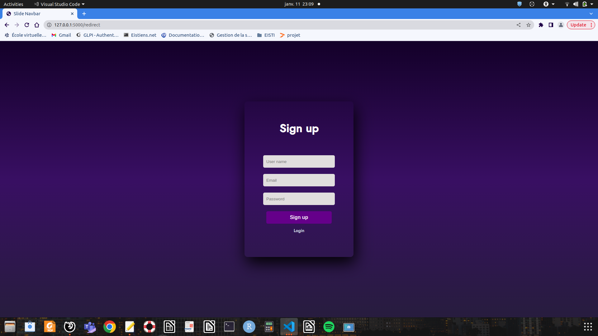
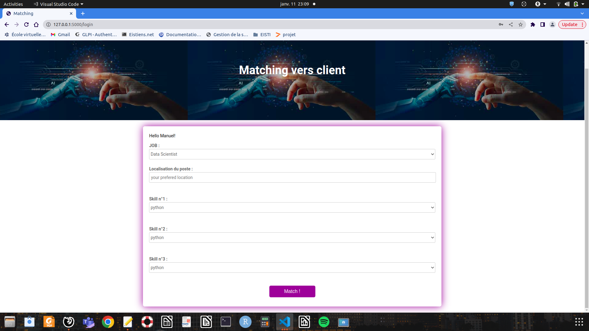
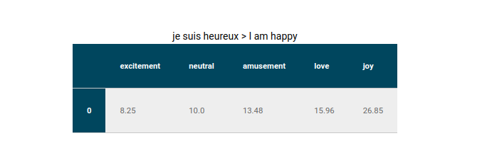

# Flask_Docker_Mongodb
Implementation of a sentiment analysis system in IT using NLP techniques.

## Technologies

### Flask 
A lightweight WSGI web application framework used to implement the different routes of our API.

### MongoDb
NoSQL Database .It permits us to manage our application more efficiently at scale where are stored the informations about the jobs such as the title , the description, the company and the salary.

### Nginx for Reverse Proxy
Used to direct client requests to the appropriate back-end server. It provides an additional layer of abstraction and control to ensure the smooth flow of network traffic between clients and servers.Security is enhanced when all accesses go through the reverse-proxy, and direct accesses to the backend are blocked.


## How to install

### 1-Clone Repo
```shell
git clone https://github.com/Manuelnkegoum-8/Flask_Docker_Mongodb.git
```

### 2-Build
```shell
$docker-compose build
```
### 3-Start and debug
```shell
$docker-compose up
```
Then open your browser and start the app at [localhost:5000]()
## How to use
### 1-Create an user account


### 2-Enter your sentence


### 3-Get your results


